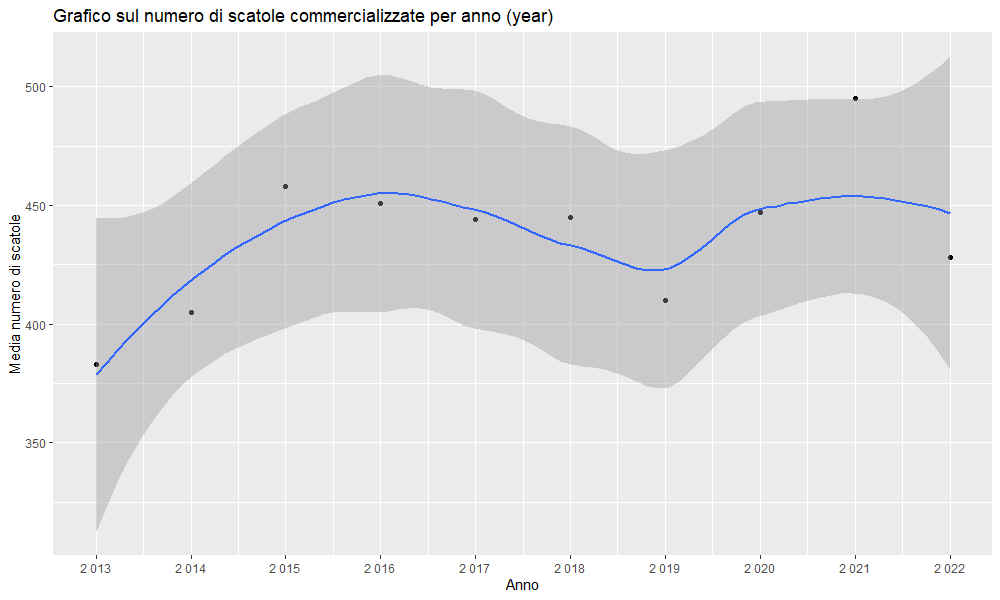
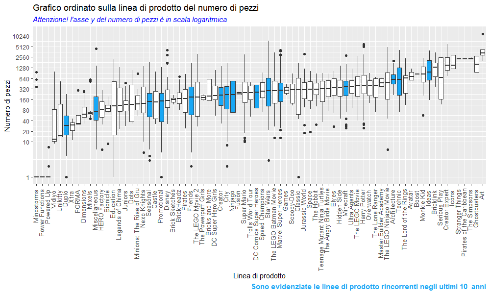

```{r setup, include=FALSE}
knitr::opts_chunk$set(echo = FALSE)
```

<script src="https://ajax.googleapis.com/ajax/libs/jquery/1.12.2/jquery.min.js"></script>

<script>
    $(document).ready(function() {
      $('slide:not(.title-slide, .backdrop, .segue)').append('<footer label=\"Progetto di Fondamenti di Scienza dei Dati e Laboratorio - Claudio Molaro\"></footer>');    
    })
</script>

# Motivazioni
## Perchè questo progetto
- Nel mio tempo libero mi piace costruire con i LEGO®, sono un appassionato, *AFOL* - **Adult Fan of LEGO**
- Ho approfittato delle competenze acquisite durante il corso di Fondamenti di Scienza dei dati per analizzare le scatole vendute dalla LEGO® negli ultimi 10 anni
- L'obiettivo è trovare dei criteri che mi aiutino a comprare le scatole commercializzate più convenienti in termini di prezzo e numero di pezzi

# Dataset

## Brickset
- Esiste un sito internet, https://brickset.com/, gestito direttamente da appassionati come me, riconosciuto dalla LEGO® come LEGO FAN MEDIA che ha catalogato tutte le scatole prodotte
- La piattaforma, una volta iscritti, mette a disposizione una API che ho interrogato per raccogliere tutte le informazioni delle scatole negli ultimi 10 anni.
- https://brickset.com/article/52664/api-version-3-documentation

- Purtroppo le informazioni sul prezzo di vendita nell'area euro (LEGOCom.DE.retailPrice) non sono sempre disponibili, soprattutto per scatole vecchie o prodottte per mercati particolari, ed ho dovuto integrare il file CSV con le informazioni prese da un altro sito internet: https://www.brickeconomy.com/

## Brickeconomy
- La piattaforma https://www.brickeconomy.com/ è specializzata nel analizzare il prezzo ed il suo andamento nell'arco del tempo.
- Vuole essere da supporto ai collezionisti che in genere sono molto più attenti al aspetto economico quando devono acquistare o scambiare le scatole da altri.

## Script in R - ImportTidy.R
- Lo scrit realizzato in R, *ImportTidy.R* si occupa di interrogare l'api di Brickset e raccogliere in un file CSV tutte le informazioni sulle scatole prodotte.
  - Produce in realtà due file CSV:
    - **tot_tibble_sets.csv** (*PRINCIPALE*) : elenco delle scatole con le informazioni utili, comprese di prezzo
    - **tot_tibble_sets_na.csv**: elenco delle scatole prive di prezzo da controllare ed inserirle nel file tot_sets_null.csv
  - Esiste un altro file CSV, **tot_sets_null.csv** che è stato modificato a mano inserendo il prezzo (retailPrice) trovato su BrickEconomy e la tipologia di vendita per escludere alcune scatole ad esempio le promozionali o quelle riservate e non in vendita.
  
## Script in R - Visualize.R
- L'altro script realizzato in R, *Visualize.R* si occupa di creare e visualizzare i grafici utile per rispondere alle (**tante**) domande che mi sono posto per trovare i criteri che mi aiutino a comprare le scatole commercializzate più convenienti in termini di prezzo e numero di pezzi.

## Composizione del CSV tot_tibble_sets.csv {.nofooter}
- Il file csv principale contiene le seguenti informazioni:
  - *number*: identificatico univoco della scatola
  - *name*: titolo della scatola
  - *year*: anno di produzione
  - *theme*: linee di prodotto
  - *themeGroup*: raggruppamento sulla linee di prodotto
  - *subtheme*: sotto linee di prodotto
  - *category*: tipologia di prodotto (Normal)
  - *packagingType*: tipologia di imballaggio
  - *availability*: tipologia di vendita
  - *ageRange*: età consigliata
  - *minifigs*: numero di omini presenti
  - *pieces*: numero di pezzi
  - *retailPrice*: prezzo di vendita in euro
  - *pp*: rapporto tra il prezzo ed il numero di pezzi
  - *collections.ownedBy*: numero di preferenze di chi ha comprato la scatola
  - *collections.wantedBy*: numero di preferenze di chi vorrebbe comprare la scatola
  
## Esclusioni
- Sono state escluse le scatole evidenziate da BrickSet come:
  - *availability* (tipologia di vendita): promozionali **Promotional** e non in vendita **Not sold**
  - *theme* (linea di prodotto): appartenete alla linea di prodotto **Collectable Minifigures** e **Books**
  - *subtheme*(sottotema): evidenziata come regalo **Magazine Gift** e **Gift with Purchase**

# Domande

## Andamento della media del rapporto tra prezzo e numero di pezzi negli ultimi 10 anni {.nofooter}
- Grafico sulla media del rapporto tra il prezzo ed il numero di pezzi negli ultimi 10 anni
{.responsive}
- *Come è possibile, con quello che costano le scatole!*
- Verifichiamo un attimo la media del numero di pezzi

{.responsive}
- Verifichiamo un attimo la media del prezzo
{.responsive}
- Mi sembra che *l'aumento del prezzo e del numero di pezzi sia notevole negli ultimi 4 anni*
- Verifichiamo anche il numero di scatole commercializzate
{.responsive}
- Cambio di rotta dal 2015, probabilmente se andiamo più indietro il numero di scatole erano minori.

## Analizziamo come il prezzo, il numero di pezzi, ed il rapporto prezzo numero di pezzi si distribuisce sulle linee di prodotto{.nofooter}

- Alcune considerazioni valide per tutti i grafici di questa sezione:
  - All'asse delle y è stata applicata una scala logaritmica per visualizzare meglio il grafico.
  In realtà i valori dell'asse delle y sono **schiacciati** verso il basso
  - In <span style="color:#18a7f5;">azzurro</span> sono evidenziate le linee di prodotto sempre presenti negli ultimi 10 anni

- <span style="color:#18a7f5;font-style: italic;">Grafico di tipo boxplot sulla media del prezzo</span>
{.responsive}

- A sinistra da *Mixels ~ Brickheadz* sono linee di prodotto che **costano poco**, legato all'acquisto di impulso, tipicamente riservata ai bambini
- A destra da *Ideas  ~ Serious Play* sono linee di prodotto che **costano molto**, tipicamente riservate al mondo degli adulti

- <span style="color:#18a7f5;font-style: italic;">Grafico di tipo boxplot sulla media del numero di pezzi</span>
{.responsive}
- A sinistra da *Mindstorm ~ Powered Up* sono linee di prodotto con pezzi *elettronici* che contengono anche un singolo componente
- A destra *Art* è una linee di prodotto specializzata nella realizzazione di mosaici, tanti pezzi tutti uguali.
- <span style="color:#18a7f5;font-style: italic;">Grafico di tipo boxplot sul rapporto tra il prezzo ed il numero di pezzi</span>
{.responsive}
- **Grafico più interessante** ci dà un sacco di indicazioni:
  - la linee di prodotto *Duplo* riservata ai **cuccioli di uomo**, costa (*TANTO*)
  - la linee di prodotto *Education* ha una coda lunga (scatole molto particolari)
  - la linee di prodotto *Classic* sembra costare poco ma ci sono molte eccezioni (outliers con valori alti)

## Valutazione delle linee di prodotto migliori secondo il rapporto tra il prezzo ed il n. pezzi {.nofooter}

- <span style="color:#18a7f5;font-style: italic;">Grafico di tipo boxplot sul rapporto tra il prezzo ed il numero di pezzi (zoom)</span>
{.responsive}
- Le linee di prodotto più interessanti sono: *Classic, Creator Expert, Creator, Bricklink*
  - Contengo molti pezzi **diversi** ad un prezzo conveniente
- Le altre linee Art, Mixels, Dots contengono pezzi simili o pochi.


## Modello di classificazione sulla preferenza data dal utente sulla piattaforma Brickset {.nofooter}

- Verifica se applicando un modello di regressione posso prevedere se la scatola verrà apprezzata, numero di preferenze maggiore (*preferences*)
- Ho provato ad appliccare il modello alle variabili:
  - **pp**: rapporto tra il prezzo ed il numero di pezzi
  
  - **retailPrice**: prezzo della scatola
  
  - **pieces**: n. di pezzi della scatola
  

- Non posso applicare un modello di regressione, l'errore standar residuo risulta essere elevato, dovrebbe tendere a 0
- Nessuna delle variabili **pp, retailPrice, pieces** risulta essere determinante.
- Verifica di come si dispongono le preferenze

- Ho deciso di applicare un modello di classificazione sulle preferenze date sopra ai 20000
{.centered}

- Molto interessante l'indicazione data dall'albero di decisione
{.responsive}

- Una scatola che appartiene alle linee: Creator Expert, Star Wars, Icons, Ideas, Harry Potter e contiene più di 4 omini e un numero di pezzi superiore a 1688 potrebbe diventare una scatola apprezzata da molte persone.


